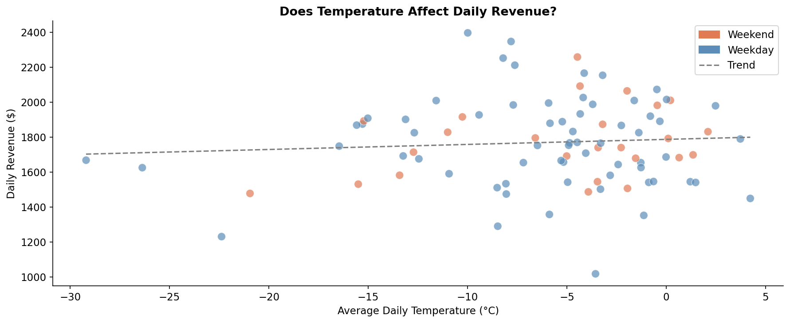
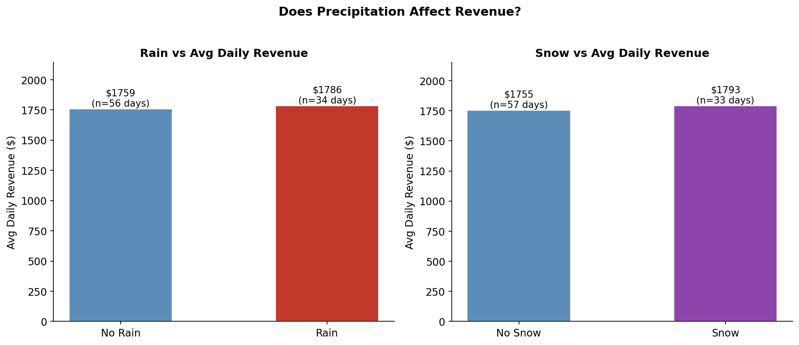
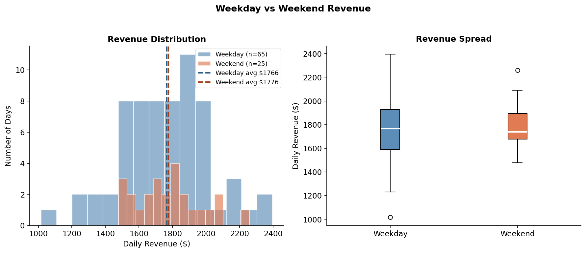
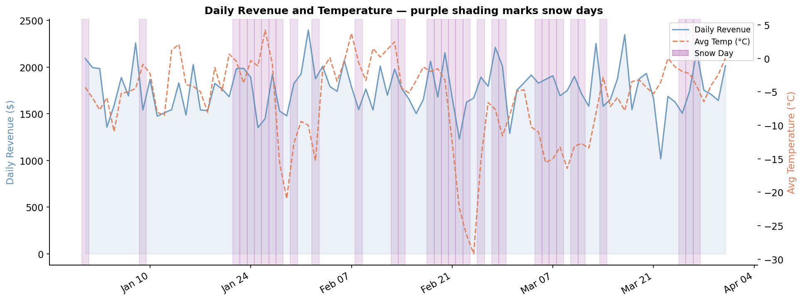

# Restaurant Weather Analysis

## Project Overview
This project investigates whether weather conditions affect a restaurant's 
daily revenue and order volume during Q1 2023 in Calgary, Alberta.

## Business Question
Do factors like temperature, rain, and snow meaningfully impact how much 
a restaurant makes on a given day — and should managers adjust operations 
based on weather forecasts?

## Key Findings
- Weather did **not** negatively impact revenue during winter months
- Rainy days averaged **$27 higher** revenue than dry days
- Snowy days averaged **$38 higher** revenue than non-snowy days
- Temperature had almost **no linear relationship** with daily revenue (r = 0.074)
- This restaurant's customer base appears **weather-resilient** in winter

## Tools Used
- Python
- Pandas
- Matplotlib
- Jupyter Notebook
- Open-Meteo Weather API

## Data Sources
- Restaurant orders: Maven Analytics Restaurant Dataset
- Weather data: Open-Meteo Historical Weather API (Calgary, AB)

## Project Structure
```
restaurant_weather_analysis/
│
├── data/
│   ├── raw/                  # Original unmodified data files
│   └── processed/            # Cleaned and merged analysis table
│
├── notebooks/
│   └── restaurant_weather_analysis.ipynb
│
└── outputs/                  # All charts saved here
```

## Charts




```

Click **Commit changes**.

---

## What you have now

Your project is live on the internet at:
```
https://github.com/YOUR_USERNAME/restaurant-weather-analysis
